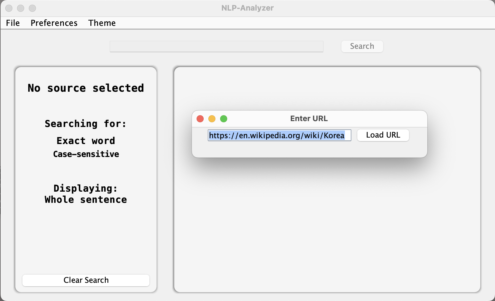
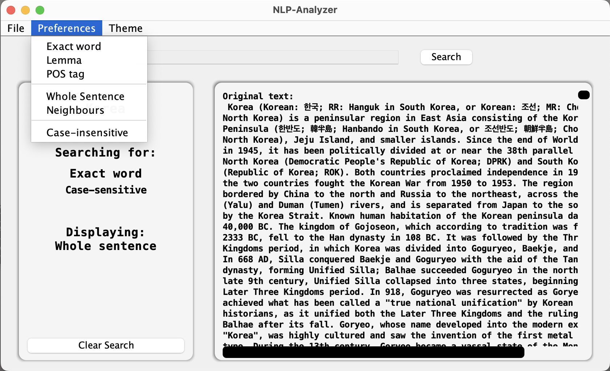
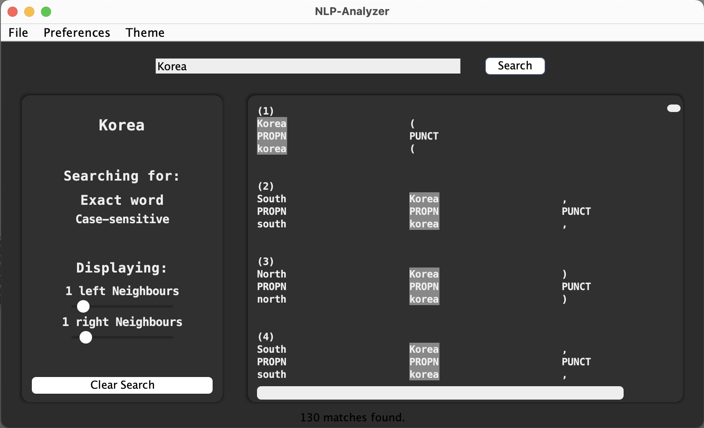
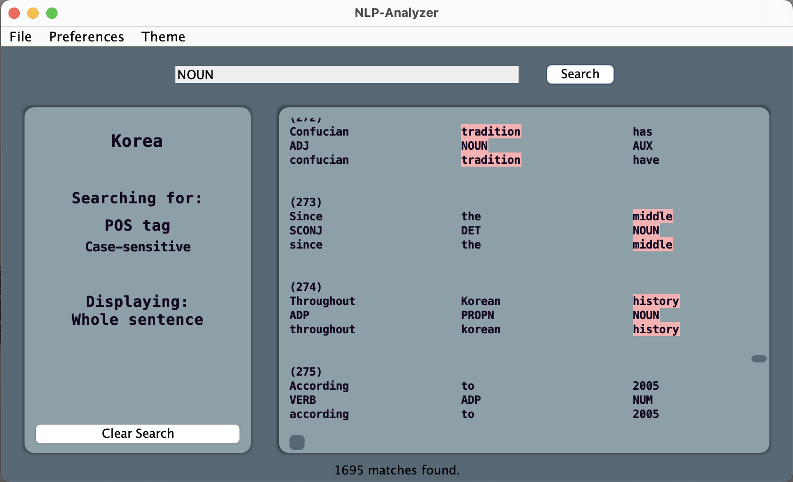

# NLP-Analyser-2023

This app, written in Java, was a final Project for ‘Data Structures and Algorithms for CL II’ I took at the University of Tübingen. As a part of a team of 4 students, my responsibility was the UI of the app, for which I used the Swing GUI toolkit for Java.
*Disclaimer: I cannot publish the source code of this project, as it is a graded task for students in the current iteration of the course.*

